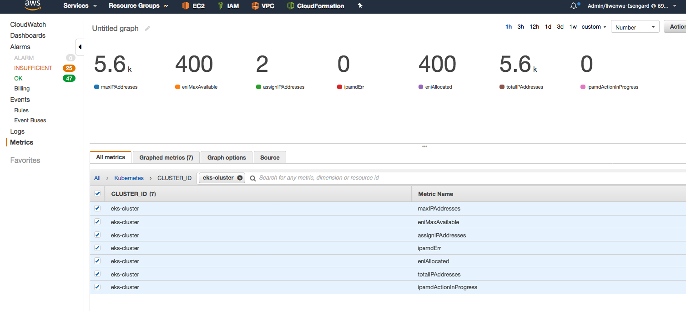
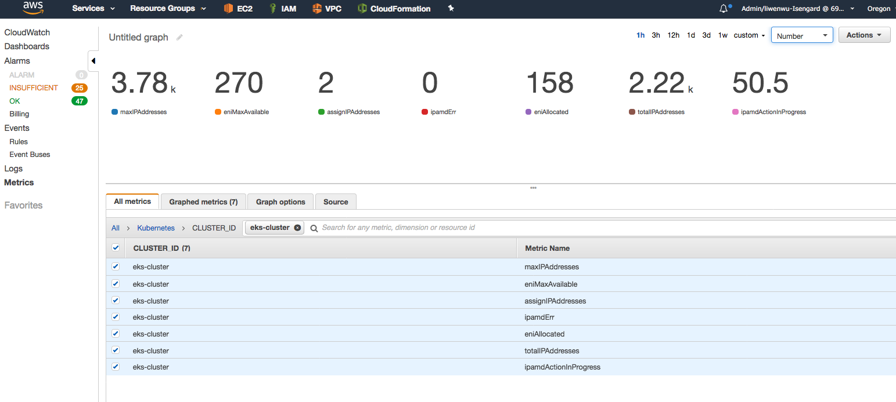

# Troubleshooting Tips


## Manage Pod's IP address pool at cluster level
As described in [Proposal: CNI plugin for Kubernetes networking over AWS VPC](./cni-proposal.md), ipamD allocates ENIs and secondary IP addresses from the instance subnet.

A node, based on the instance type ([Limit](http://docs.aws.amazon.com/AWSEC2/latest/UserGuide/using-eni.html#AvailableIpPerENI)), can have up to N ENIs and M addresses. The maximum number of IP addresses available to Pods on this node is min((N*M -N), subnet's free IP)

### Tip: Make sure subnet have enough available addresses
 If a subnet runs out of IP addresses, ipamD will not able to get secondary IP addresses.  When this happens, pods assigned to this node may not able to get an IP and get stucked in ** ContainerCreating**.

You can check the available IP addresses in AWS console:


#### known issue: [Leaking ENIs](https://github.com/aws/amazon-vpc-cni-k8s/issues/69) can cause a subnet available IP pool being depleted and requires user intervention.

### Tip: Make sure there are enough ENIs and IPs for Pods in the cluster

We provide a tool [**cni-metrics-helper**](./misc/cni_metrics_helper.yaml) which can show aggregated ENIs and IPs information at the cluster level.  

You can optionally push them to cloudwatch.  For example:



**maxIPAddress**: the maximum number of IP addresses that can be used for Pods in the cluster. (assumes there is enough IPs in the subnet).

**totalIPAddresses**: the total number of secondary IP addresses attached to the instances in the cluster.

**assignIPAddresses**: the total number of IP addresses already assigned to Pods in cluster.

If you need to deploy more Pods than **maxIPAddresses**, you need to increase your cluster and add more nodes.

### Tip: Running Large cluster
When running 500 nodes cluster, we noticed that when there is a burst of pod scale up event (e.g. scale pods from 0 to 23000) at onetime, it can trigger all node's ipamD start allocating ENIs.  Due to EC2 resource limit nature, some node's ipamD can get throttled and go into exponentially backoff before retry. If a pod is assigned to this node and its ipamD is waiting to retry, the pod could stay in **ContainerCreating** until ENI retry succeed.

You can verify if you are in this situation by example cni metrics

**ipamdActionInProgress**: the total number of nodes whose ipamD is in the middle of ENI operation.

To avoid Pod deployment delay, you can configure ipamD to have a higher [**WARM\_ENI\_TARGET**](https://github.com/aws/amazon-vpc-cni-k8s/pull/68).

## Troubleshooting CNI/ipamD at node level

### debugging logs are stored in
```
/var/log/aws-routed-eni
[ec2-user@ip-192-168-188-7 aws-routed-eni]$ ls 
ipamd.log.2018-05-15-21  ipamd.log.2018-05-16-02  ipamd.log.2018-05-16-07  ipamd.log.2018-05-16-12  ipamd.log.2018-05-16-17  plugin.log.2018-05-16-00  plugin.log.2018-05-16-19
ipamd.log.2018-05-15-22  ipamd.log.2018-05-16-03  ipamd.log.2018-05-16-08  ipamd.log.2018-05-16-13  ipamd.log.2018-05-16-18  plugin.log.2018-05-16-02
ipamd.log.2018-05-15-23  ipamd.log.2018-05-16-04  ipamd.log.2018-05-16-09  ipamd.log.2018-05-16-14  ipamd.log.2018-05-16-19  plugin.log.2018-05-16-03
ipamd.log.2018-05-16-00  ipamd.log.2018-05-16-05  ipamd.log.2018-05-16-10  ipamd.log.2018-05-16-15  ipamd.log.2018-05-16-20  plugin.log.2018-05-16-04
ipamd.log.2018-05-16-01  ipamd.log.2018-05-16-06  ipamd.log.2018-05-16-11  ipamd.log.2018-05-16-16  ipamd.log.2018-05-16-21  plugin.log.2018-05-16-14
[ec2-user@ip-192-168-188-7 aws-routed-eni]$ 
```

### collecting node level tech-support bundle for offline troubleshooting

```
[root@ip-192-168-188-7 aws-routed-eni]# /opt/cni/bin/aws-cni-support.sh 

// download
/var/log/aws-routed-eni/aws-cni-support.tar.gz

```

### ipamD debugging commands

```
// get enis info
[root@ip-192-168-188-7 bin]# curl http://localhost:61678/v1/enis | python -m json.tool
  % Total    % Received % Xferd  Average Speed   Time    Time     Time  Current
                                 Dload  Upload   Total   Spent    Left  Speed
100  2589    0  2589    0     0   2589      0 --:--:-- --:--:-- --:--:--  505k
{
    "AssignedIPs": 46,  
    "ENIIPPools": {
        "eni-0248f7351c1dab6b4": {
            "AssignedIPv4Addresses": 14,
            "DeviceNumber": 2,
            "IPv4Addresses": {
                "192.168.134.93": {
                    "Assigned": true
                },
                "192.168.135.243": {
                    "Assigned": true
                },
                "192.168.137.75": {
                    "Assigned": true
                },
                "192.168.141.97": {
                    "Assigned": true
                },
                "192.168.143.223": {
                    "Assigned": true
                },
                "192.168.154.40": {
                    "Assigned": true
                },
                "192.168.161.99": {
                    "Assigned": true

...
                   "Assigned": false
                },
                "192.168.177.82": {
                    "Assigned": true
                },
                "192.168.179.236": {
                    "Assigned": false
                },
                "192.168.184.253": {
                    "Assigned": false
                }
            },
            "Id": "eni-0ebff0ef030f81d5c",
            "IsPrimary": false
        }
    },
    "TotalIPs": 56
}
```

```
// get IP assignment info
[root@ip-192-168-188-7 bin]# curl http://localhost:61678/v1/pods | python -m json.tool
  % Total    % Received % Xferd  Average Speed   Time    Time     Time  Current
                                 Dload  Upload   Total   Spent    Left  Speed
100  6688    0  6688    0     0   6688      0 --:--:-- --:--:-- --:--:-- 1306k
{
    "cni-metrics-helper-6dcff5ddf4-v5l6d_kube-system_": {
        "DeviceNumber": 0,
        "IP": "192.168.181.95"
    },
    "worker-hello-5974f49799-2hkc4_default_f7dba23f452c4c7fc5d51344aeadf82922e40b838ffb5f13b057038f74928a31": {
        "DeviceNumber": 0,
        "IP": "192.168.135.154"
    },
    "worker-hello-5974f49799-4fj9p_default_40faa88f59f73e38c3f791f3c3208240a00b49dcad406d5edbb2c8c87ed9dd36": {
        "DeviceNumber": 3,
        "IP": "192.168.164.251"
    },
    "worker-hello-5974f49799-4wh62_default_424f0d03175c2d62817aad1810413873703ca00251284646ed5dae60fdbc447f": {
        "DeviceNumber": 2,
        "IP": "192.168.179.14"
    },
...
}
```

```
// get ipamD metrics
root@ip-192-168-188-7 bin]# curl http://localhost:61678/metrics
# HELP assigned_ip_addresses The number of IP addresses assigned
# TYPE assigned_ip_addresses gauge
assigned_ip_addresses 46
# HELP eni_allocated The number of ENI allocated
# TYPE eni_allocated gauge
eni_allocated 4
# HELP eni_max The number of maximum ENIs can be attached to the instance
# TYPE eni_max gauge
eni_max 4
# HELP go_gc_duration_seconds A summary of the GC invocation durations.
# TYPE go_gc_duration_seconds summary
go_gc_duration_seconds{quantile="0"} 5.6955e-05
go_gc_duration_seconds{quantile="0.25"} 9.5069e-05
go_gc_duration_seconds{quantile="0.5"} 0.000120296
go_gc_duration_seconds{quantile="0.75"} 0.000265345
go_gc_duration_seconds{quantile="1"} 0.000560554
go_gc_duration_seconds_sum 0.03659199
go_gc_duration_seconds_count 211
# HELP go_goroutines Number of goroutines that currently exist.
# TYPE go_goroutines gauge
go_goroutines 20
...
```

## cni-metrics-helper 

The following show how cni-metrics-helper works in a cluster:


### install cni-metrics-helper
``
kubectl apply -f misc/cni_metrics_helper.yaml
``

### get cni-metrics-helper logs

```
kubectl get pod -n kube-system
NAME                                  READY     STATUS    RESTARTS   AGE
aws-node-248ns                        1/1       Running   0          6h
aws-node-257bn                        1/1       Running   0          2h
...
cni-metrics-helper-6dcff5ddf4-v5l6d   1/1       Running   0          7h
kube-dns-75fddcb66f-48tzn             3/3       Running   0          1d
```

```
kubectl logs cni-metrics-helper-6dcff5ddf4-v5l6d -n kube-system
```
### cni-metrics-helper key log messages

```
# following shows the aggregated metrics. this can be optionally sent to cloudwatch
I0516 17:11:58.489648       7 metrics.go:350] Produce GAUGE metrics: ipamdActionInProgress, value: 0.000000
I0516 17:11:58.489657       7 metrics.go:350] Produce GAUGE metrics: assignIPAddresses, value: 2.000000
I0516 17:11:58.489665       7 metrics.go:350] Produce GAUGE metrics: totalIPAddresses, value: 11186.000000
I0516 17:11:58.489674       7 metrics.go:350] Produce GAUGE metrics: eniMaxAvailable, value: 800.000000
I0516 17:11:58.489685       7 metrics.go:340] Produce COUNTER metrics: ipamdErr, value: 1.000000
I0516 17:11:58.489695       7 metrics.go:350] Produce GAUGE metrics: eniAllocated, value: 799.000000
I0516 17:11:58.489715       7 metrics.go:350] Produce GAUGE metrics: maxIPAddresses, value: 11200.000000
```


